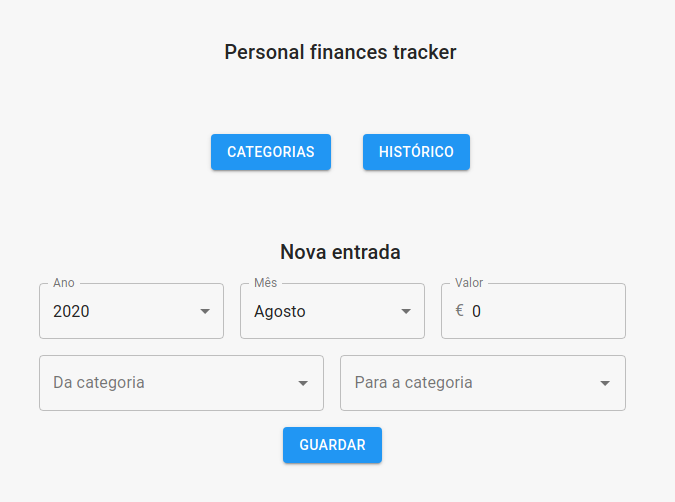

# Personal Finances Tracker

Seguir de uma forma simples os gastos financeiros.

### Instalar

1. Clonar projeto com `git clone https://github.com/hrafaelveloso/personal-finances-tracking.git`
2. Aceder à pasta criada (`cd personal-finances-tracking`).

Dentro da página do projeto:

1. Correr `npm install`
2. Criar o ficheiro `.env`, com a mesma estrutura do ficheiro `.env.example`.
3. Adicionar as variáveis de ambiente `MONGO_URI` e `SECRET_OR_KEY`.
4. Correr a ferramenta com  `npm run dev`

### Deployment

Este projeto pode ser colocado em ambiente de produção no [heroku](https://www.heroku.com). 

### Features

#### 1. Login
   
A ferramenta está protegida com um login de email/password. Existe um endpoint `api/users/register` para criar utilizadores. (Este endpoint pode ser comentado/eliminado).

#### 2. Categorias

É possível criar, editar e eliminar categorias. As categorias servem para definir de onde e para onde é que foi efetuado o fluxo do movimento.

#### 3. Entradas

Cada entrada é caracterizada por:

1. Ano e mês do movimento;
2. Categoria origem;
3. Categoria final;
4. Montante.

#### 4. Histórico

O histórico pode ser mensal ou compreendido entre duas datas:

Uma vez que as entradas têm associada um mês e ano, é possível criar um histórico e com isso desenhar 2 tipos de gráficos:

1. Gráfico de barras

2. Gráfico sankey

A organização das categorias fica ao critério do utilizador, quanto mais detalhadas forem, maior a especificidade do histórico.
